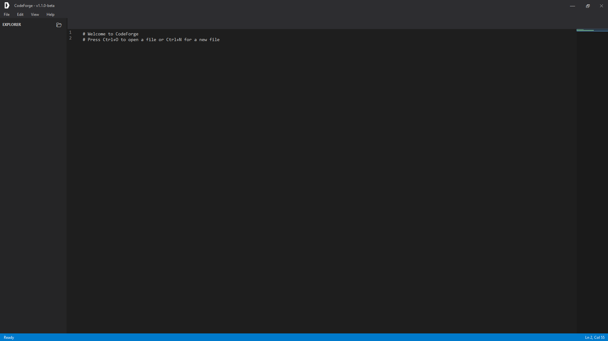
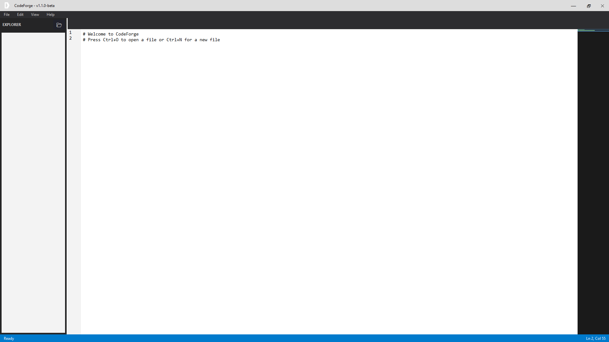
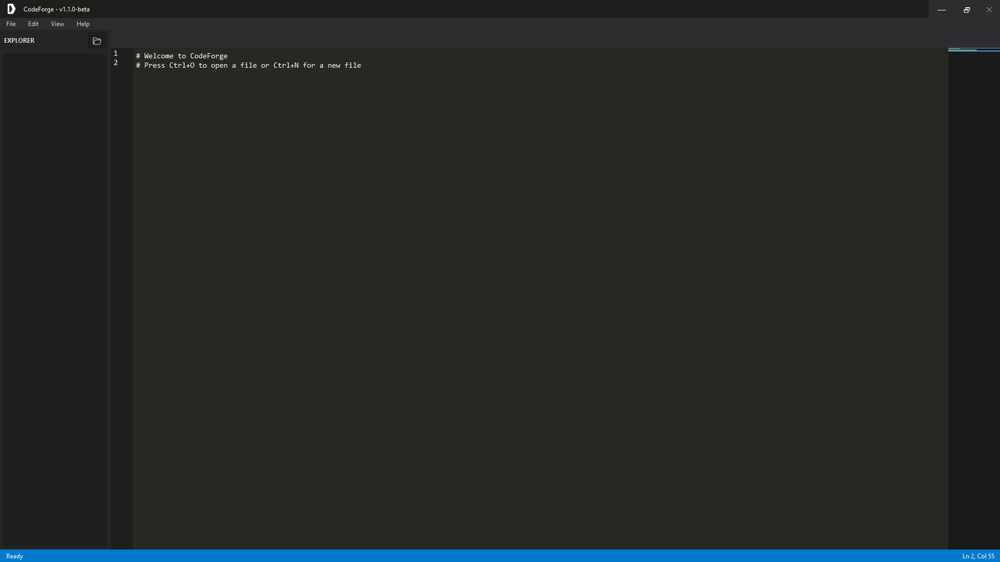
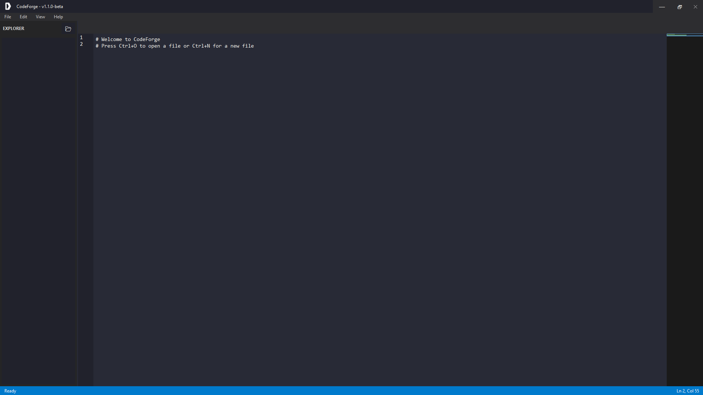

# CodeForge

<div align="center">
  
  
  **A Modern, Feature-Rich Code Editor Built with Python & Tkinter**
  
  
  
  
  
  [](https://github.com/DaRealTrueBlue/CodeForge)
  
  [Download](https://darealtrueblue.ddns.net/versions.html) • [Documentation](#-getting-started) • [Contributing](CONTRIBUTING.md) • [Changelog](#-changelog)
</div>

---

## 🌟 Features

### Smart Editing
- **Auto-Indentation** - Intelligent code block indentation
- **Auto-Complete Brackets** - Automatically closes `()`, `[]`, `{}`, `<>`
- **Bracket Matching** - Visual highlighting of matching brackets
- **Current Line Highlight** - Active line is subtly highlighted for better navigation
- **Smart Backspace** - Removes matching bracket/quote pairs together
- **Wrap Selection** - Select text and type a bracket/quote to wrap it

### Advanced Commands
- **Toggle Comments** - `Ctrl+/` to comment/uncomment lines (Python, JS, Java, C, etc.)
- **Duplicate Line** - `Ctrl+D` to duplicate current line or selection
- **Move Lines** - `Alt+Up/Down` to move lines up or down
- **Multi-Cursor** - `Ctrl+Alt+Up/Down` for basic multi-cursor support
- **Go to Line** - `Ctrl+G` to quickly jump to a specific line number
- **Find & Replace** - Enhanced with regex support, case-sensitive, and whole word options
- **Zoom Controls** - `Ctrl+=` zoom in, `Ctrl+-` zoom out, `Ctrl+0` reset zoom
- **Settings Dialog** - `Ctrl+,` to configure editor preferences

### Syntax Highlighting
Support for multiple languages:
- Python
- JavaScript/TypeScript
- Java
- C/C++/C#
- HTML
- And more...

### Productivity
- **Recent Files Menu** - Quick access to recently opened files
- **Auto-Save** - Automatically saves your work every 30 seconds
- **Minimap** - Code overview with clickable navigation
- **Integrated Terminal** - Built-in terminal for running commands
- **Multi-File Tabs** - Work on multiple files simultaneously
- **File Explorer** - Browse and open files from a folder tree

### Modern UI
- **Dark Theme** - Easy on the eyes with VS Code-inspired colour scheme
- **Custom Title Bar** - Frameless window with custom controls
- **Line Numbers** - Always visible with synchronized scrolling
- **Status Bar** - Shows cursor position and file path
- **Auto-Hide Scrollbars** - Clean interface that appears only when needed

---

## 📸 Screenshots

### Dark Theme (Default)


### Light Theme


### Monokai Theme


### Dracula Theme


---

## 🚀 Getting Started

### Download Pre-Built Executable

**Easiest option**: Download the latest release from the [versions page](http://darealtrueblue.ddns.net/versions.html).

### Run from Source

#### Prerequisites
- Python 3.8 or higher
- pip (Python package installer)

### Installation

1. Clone the repository:
```bash
git clone https://github.com/darealtrueblue/codeforge.git
cd codeforge
```

2. Install dependencies:
```bash
pip install pillow
```

3. Run CodeForge:
```bash
python code_editor.py
```

### Building Executable (Windows)

To create a standalone executable:

1. Install PyInstaller:
```bash
pip install pyinstaller
```

2. Run the build script:
```bash
.\build.bat
```

3. Find the executable in `dist/CodeForge.exe`

For more details, see [build.spec](build.spec) for PyInstaller configuration.

---

## ⌨️ Keyboard Shortcuts

### File Operations
| Shortcut | Action |
|----------|--------|
| `Ctrl+N` | New File |
| `Ctrl+O` | Open File |
| `Ctrl+S` | Save File |
| `Ctrl+Shift+S` | Save As |

### Editing
| Shortcut | Action |
|----------|--------|
| `Ctrl+Z` | Undo |
| `Ctrl+Y` | Redo |
| `Ctrl+X` | Cut |
| `Ctrl+C` | Copy |
| `Ctrl+V` | Paste |
| `Ctrl+A` | Select All |
| `Ctrl+F` | Find |
| `Ctrl+H` | Find and Replace |
| `Ctrl+/` | Toggle Comment |
| `Ctrl+D` | Duplicate Line |
| `Ctrl+W` | Close Current Tab |
| `Ctrl+G` | Go to Line |
| `Ctrl+,` | Settings |

### Navigation
| Shortcut | Action |
|----------|--------|
| `Alt+Up` | Move Line Up |
| `Alt+Down` | Move Line Down |
| `Ctrl+Alt+Up` | Add Cursor Above |
| `Ctrl+Alt+Down` | Add Cursor Below |

### View
| Shortcut | Action |
|----------|--------|
| `Ctrl+=` or `Ctrl++` | Zoom In |
| `Ctrl+-` | Zoom Out |
| `Ctrl+0` | Reset Zoom |

Access through the **View** menu:
- Toggle Terminal
- Toggle Minimap

---

## 🛠️ Technologies Used

- **Python** - Core programming language
- **Tkinter** - GUI framework
- **PIL/Pillow** - Image processing for icons
- **PyInstaller** - Executable creation

---

## 📋 Project Structure

```
codeforge/
├── code_editor.py      # Main application file
├── build.bat           # Windows build script
├── build.spec          # PyInstaller configuration
├── icon/               # Application icons
│   └── white-transparent.png
├── build/              # Build artifacts
└── dist/               # Compiled executables
```

---

## 🔧 Configuration

CodeForge includes built-in configuration options:

- **Auto-Save**: Enabled by default (30-second interval)
- **Theme**: Dark theme (VS Code inspired)
- **Font**: Consolas 11pt for code editing
- **Recent Files**: Tracks last 10 opened files

---

## 🤝 Contributing

We welcome contributions from the community! Whether it's:
- 🐛 Bug reports
- 💡 Feature requests  
- 🎨 New themes
- 📝 Documentation improvements
- 🔧 Code contributions

Please read our [Contributing Guidelines](CONTRIBUTING.md) to get started.

### Quick Start for Contributors

1. Fork the repository
2. Create a feature branch (`git checkout -b feature/AmazingFeature`)
3. Make your changes (follow our [code style](CONTRIBUTING.md#code-style))
4. Test thoroughly
5. Commit with clear messages (`git commit -m 'Add: description'`)
6. Push to your fork (`git push origin feature/AmazingFeature`)
7. Open a Pull Request

See [Contributing](CONTRIBUTING.md) for detailed guidelines.

---

## 📜 License

This project is licensed under the MIT License - see the [LICENSE](LICENSE) file for details.

---

## 🐛 Known Issues

- Ctrl+` terminal shortcut removed due to cross-platform compatibility issues (use View menu instead)
- Multi-cursor is simplified (selects matching text rather than true multiple cursors)

---

## 📝 Changelog

### Version 1.1.0-beta (Current - BETA RELEASE)
- 🎨 **Complete UI Overhaul**: Modern, fully customisable interface design
- 🎭 **Theme System**: 4 built-in themes (Dark, Light, Monokai, Dracula)
- 🔧 **Layout Customisation**: Move sidebar left/right, customise panel positions
- 💾 **Layout Profiles**: Save and load custom layout configurations as JSON
- 🎨 **Theme Switcher**: Switch themes instantly from View menu
- 📐 **Resizable Panels**: Smooth panel resizing with ttk.PanedWindow
- 🎯 **Accent Colours**: Customisable accent colours for each theme
- 🖼️ **Modern Colour Schemes**: Professional themes with proper contrast
- ⚙️ **Extended Settings**: New layout and theme preferences
- 🔄 **Layout Presets**: Quick layout switching system
- 📂 **Import/Export**: Share layouts via JSON files
- ✨ **All v1.0.6 Optimizations**: Includes all performance improvements
- ⚠️ **BETA**: This is a preview release - please report issues!

**New Menu Items**:
- View → Themes (Dark, Light, Monokai, Dracula)
- View → Layout (Sidebar position, Save/Load layouts)

**New Features**:
- Instant theme preview without restart
- Sidebar can be positioned left or right
- Layout configurations saved to/loaded from JSON
- All UI elements update dynamically with theme changes

### Version 1.0.6
- ⚡ Major performance optimizations:
  - Compiled regex pattern caching for 50% faster syntax highlighting
  - Buffered file I/O (8KB buffer) for faster file loading and saving
  - Optimized line number generation for large files
  - Status bar debouncing (50ms) for smoother cursor updates
  - Memory cleanup when closing files (garbage collection)
  - Improved undo/redo performance with better text widget configuration
  - Disabled undo tracking during file switches for instant loading
- ✨ New Features:
  - Go to Line dialog (`Ctrl+G`)
  - Enhanced Find & Replace with regex, case-sensitive, and whole word options
  - Zoom controls (`Ctrl+=`, `Ctrl+-`, `Ctrl+0`)
  - Settings dialog (`Ctrl+,`) for font, tab size, and preferences
  - ANSI colour support in terminal for colourised output
- 🐛 Bug Fixes:
  - Fixed zoom in keyboard shortcut (added `Control-equal` binding)
  - Fixed minimap rendering from barcode-like to clean 2-pixel lines
  - Fixed minimap scrolling and viewport synchronization
  - Browser cache-busting for version updates page
- 💅 UI Improvements:
  - Complete minimap redesign with smooth 2-pixel height lines
  - Better visual feedback throughout the editor

---

## 👤 Author

**DaRealTrueBlue**
- GitHub: [@DaRealTrueBlue](https://github.com/DaRealTrueBlue)
- YouTube: [@DaRealTrueBlue](https://www.youtube.com/@darealtrueblue)
- Instagram: [@darealtrueblue.lol](https://www.instagram.com/darealtrueblue.lol)
- Twitch: [@DaRealTrueBlueLive](http://twitch.tv/darealtruebluelive)

---

## 🙏 Acknowledgments

- Inspired by Visual Studio Code
- Built with ❤️ using Python and Tkinter
- Icon design and UI inspired by modern code editors

---

## 📮 Contact & Support

Have questions or suggestions?

- 🐛 **Found a bug?** [Open an issue](https://github.com/DaRealTrueBlue/CodeForge/issues/new)
- 💡 **Feature idea?** [Submit a feature request](https://github.com/DaRealTrueBlue/CodeForge/issues/new)
- 💬 **Need help?** [Start a discussion](https://github.com/DaRealTrueBlue/CodeForge/discussions)
- 🔧 **Want to contribute?** See [Contributing](CONTRIBUTING.md)

---

## 🌟 Show Your Support

If you find CodeForge useful, please:
- ⭐ Star this repository
- 🐦 Share it with others
- 🤝 Contribute to the project
- 📢 Spread the word!

---

<div align="center">
  Made with ❤️ by the CodeForge team
  
  ⭐ Star this repo if you find it useful!
</div>
